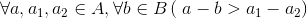

## 1. Programming Assignment: 感性接触计算机程序

### 编程题＃1：实现冒泡排序

来源: POJ (Coursera声明：在POJ上完成的习题将不会计入Coursera的最后成绩。) 

注意： 总时间限制: 1000ms 内存限制: 65536kB 

描述 
请根据自己的理解编写冒泡排序算法，数组大小1000以内 

输入 
第一行是n，表示数组的大小 
接着n行是数组的n个元素 

输出 
排序之后的结果 
一个元素一行

### 编程题＃2：奇偶排序（一）

来源: POJ (Coursera声明：在POJ上完成的习题将不会计入Coursera的最后成绩。) 

注意： 总时间限制: 1000ms 内存限制: 65536kB

描述 
输入十个整数，将十个整数按升序排列输出，并且奇数在前，偶数在后。

输入 
输入十个整数 

输出 
按照奇偶排序好的十个整数 

### 编程题＃3：奇偶排序（二）

来源: POJ (Coursera声明：在POJ上完成的习题将不会计入Coursera的最后成绩。) 

注意： 总时间限制: 1000ms 内存限制: 65536kB 

描述 
和上题一样，但是要求用第二种解法 

输入 
输入十个整数 

输出 
按照奇偶排序好的十个整数 

## 2. Programming Assignment: 从现实问题到计算机程序

### 编程题＃1： 晶晶赴约会
来源: POJ (Coursera声明：在POJ上完成的习题将不会计入Coursera的最后成绩。)

注意： 总时间限制: 1000ms 内存限制: 65536kB

描述
晶晶的朋友贝贝约晶晶下周一起去看展览，但晶晶每周的1、3、5有课必须上课，请帮晶晶判断她能否接受贝贝的邀请，如果能输出YES；如果不能则输出NO。

输入
输入有一行，贝贝邀请晶晶去看展览的日期，用数字1到7表示从星期一到星期日。

输出
输出有一行，如果晶晶可以接受贝贝的邀请，输出YES，否则，输出NO。注意YES和NO都是大写字母！

### 编程题＃2：奇数求和
来源: POJ (Coursera声明：在POJ上完成的习题将不会计入Coursera的最后成绩。)

注意： 总时间限制: 1000ms 内存限制: 65536kB

描述
计算正整数 m 到 n（包括m 和 n ）之间的所有奇数的和，其中，m 不大于 n，且n 不大于300。例如 m=3, n=12, 其和则为：3+5+7+9+11=35

输入
两个数 m 和 n，两个数以空格间隔，其中 0<=m <= n <= 300 。

输出
奇数之和

### 编程题＃3：整数的个数
来源: POJ (Coursera声明：在POJ上完成的习题将不会计入Coursera的最后成绩。)

注意： 总时间限制: 1000ms 内存限制: 65536kB

描述
给定k（1<k<100）个正整数，其中每个数都是大于等于1，小于等于10的数。写程序计算给定的k个正整数中，1，5和10出现的次数。

输入
输入有两行：第一行包含一个正整数k，第二行包含k个正整数，每两个正整数用一个空格分开。

输出
输出有三行，第一行为1出现的次数，，第二行为5出现的次数，第三行为10出现的次数。

### 编程题＃4：1的个数
来源: POJ (Coursera声明：在POJ上完成的习题将不会计入Coursera的最后成绩。)

注意： 总时间限制: 1000ms 内存限制: 65536kB

描述
给定一个十进制整数N，求其对应2进制数中1的个数

输入
第一个整数表示有N组测试数据，其后N行是对应的测试数据，每行为一个整数。

输出
N行，每行输出对应一个输入。

### 编程题＃5：数组逆序重放
来源: POJ (Coursera声明：在POJ上完成的习题将不会计入Coursera的最后成绩。)

注意： 总时间限制: 1000ms 内存限制: 65536kB

描述
将一个数组中的值按逆序重新存放。例如，原来的顺序为8,6,5,4,1。要求改为1,4,5,6,8。

输入
输入为两行：第一行数组中元素的个数n（1<n<100)，第二行是n个整数，每两个整数之间用空格分隔。

输出
输出为一行：输出逆序后数组的整数，每两个整数之间用空格分隔。

## 3. Programming Assignment: 理性认识C程序 导论 抄写题

### 抄写题＃1：细菌实验分组
来源: POJ (Coursera声明：在POJ上完成的习题将不会计入Coursera的最后成绩。)

注意： 总时间限制: 1000ms 内存限制: 65536kB

描述
有一种细菌分为A、B两个亚种，它们的外在特征几乎完全相同，仅仅在繁殖能力上有显著差别，A亚种繁殖能力非常强，B亚种的繁殖能力很弱。在一次为时一个小时的细菌繁殖实验中，实验员由于疏忽把细菌培养皿搞乱了，请你编写一个程序，根据实验结果，把两个亚种的培养皿重新分成两组。

细菌繁殖能力（繁殖率）的量化标准为一个小时内细菌数量增长的比例（繁殖率 = 一小时后细菌数量 / 原本细菌数量）。

两个亚种繁殖能力差异很大，这意味着对于任意两个同种细菌培养皿的繁殖率的测量值之间的差异要小于任意两个异种细菌培养皿繁殖率的测量值之间的差异。即：

输入
输入有多行，第一行为整数n（n≤100），表示有n个培养皿。

其余n行，每行有三个整数，分别代表培养皿编号，试验前细菌数量，试验后细菌数量。假设试验没有误差。

输出
输出有多行：

第一行输出A亚种培养皿的数量，其后每行输出A亚种培养皿的编号，按繁殖率升序排列。

然后一行输出B亚种培养皿的数量，其后每行输出B亚种培养皿的编号，也按繁殖率升序排列。

### 编程题＃1：苹果和虫子
来源: POJ (Coursera声明：在POJ上完成的习题将不会计入Coursera的最后成绩。)

注意： 总时间限制: 1000ms 内存限制: 65536kB

描述
你买了一箱n个苹果，很不幸的是买完时箱子里混进了一条虫子。虫子每x小时能吃掉一个苹果，假设虫子在吃完一个苹果之前不会吃另一个，那么经过y小时你还有多少个完整的苹果？

输入
输入仅一行，包括n，x和y（均为整数）。

输出
输出也仅一行，剩下的苹果个数

### 编程题＃2：大象喝水
来源: POJ (Coursera声明：在POJ上完成的习题将不会计入Coursera的最后成绩。)

注意： 总时间限制: 1000ms 内存限制: 65536kB

描述
一只大象口渴了，要喝20升水才能解渴，但现在只有一个深h厘米，底面半径为r厘米的小圆桶(h和r都是整数)。问大象至少要喝多少桶水才会解渴。

输入
输入有一行：包行两个整数，以一个空格分开，分别表示小圆桶的深h和底面半径r，单位都是厘米。

输出
输出一行，包含一个整数，表示大象至少要喝水的桶数。

### 编程题＃3：最高的分数
来源: POJ (Coursera声明：在POJ上完成的习题将不会计入Coursera的最后成绩。)

注意： 总时间限制: 1000ms 内存限制: 65536kB

描述
孙老师讲授的《计算概论》这门课期中考试刚刚结束，他想知道考试中取得的最高分数。因为人数比较多，他觉得这件事情交给计算机来做比较方便。你能帮孙老师解决这个问题吗？

输入
输入两行，第一行为整数n（1 <= n < 100），表示参加这次考试的人数.第二行是这n个学生的成绩，相邻两个数之间用单个空格隔开。所有成绩均为0到100之间的整数。

输出
输出一个整数，即最高的成绩。

### 编程题＃4：最大奇数与最小偶数之差的绝对值
来源: POJ (Coursera声明：在POJ上完成的习题将不会计入Coursera的最后成绩。)

注意： 总时间限制: 1000ms 内存限制: 65536kB

描述
输入6个正整数，且这6个正整数中至少存在一个奇数和一个偶数。

设这6个正整数中最大的奇数为a，最小的偶数为b，求出|a-b|的值

输入
输入为一行，6个正整数,且6个正整数都小于100

输入保证这6个数中至少存在一个奇数和一个偶数

输出
输出为一行，输出最大的奇数与最小的偶数之差的绝对值

### 编程题＃5：分离整数的各个数位
来源: POJ (Coursera声明：在POJ上完成的习题将不会计入Coursera的最后成绩。)

注意： 总时间限制: 1000ms 内存限制: 65536kB

描述
从键盘输入一个任意的三位整数，要求正确地分离出它的百位、十位和个位数，并分别在屏幕上输出，输出采用每行输出一个数的方式，不带其它符号。

输入
一个任意的三位整数

输出
一个任意的三位整数
